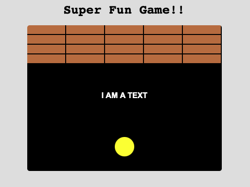

## Draw on Canvas



### In your REPL project

- Create a file `index.html` and copy & paste the following content into it

```
<!DOCTYPE html>
<html>
<head>     
    <script src="./script.js">
    </script>
    <link href="./style.css" rel="stylesheet"/>
</head>

<h1>Super Fun Game!!</h1>

<canvas id="gameCanvas" width="400" height="300"></canvas>

</html>
```

- create `script.js` file  and copy & paste the following

```
var canvas, canvasContext;

//bricks variables and constants
const BRICK_WIDTH = 30;
const BRICK_HEIGHT = 20;
const BRICK_COLS = 3;
const BRICK_GAP = 2;
const BRICK_ROWS = 3;
const BRICK_COLOR = '#B4693B'
var brickGrid = new Array(BRICK_COLS * BRICK_ROWS);
var bricksLeft = 0;

// Fires after the page is finished loading
window.onload = function() {
  canvas = document.getElementById('gameCanvas');
  canvasContext = canvas.getContext('2d');

  drawAll();
}


function rowColToArrayIndex(col, row) {
  return col + row * BRICK_COLS;
}


function drawBricks() {
  for(var eachRow = 0; eachRow < BRICK_ROWS; eachRow++) {
    for(var eachCol = 0; eachCol < BRICK_COLS; eachCol++) {
    brick((BRICK_WIDTH*eachCol), BRICK_HEIGHT*eachRow, 
    BRICK_WIDTH-BRICK_GAP, 
    BRICK_HEIGHT-BRICK_GAP)
    }
  }//end of brick for
}//end of drawBricks

function drawAll() {
  //background
  rect(0, 0, canvas.width, canvas.height, 'black');

  //bricks
  drawBricks();
  drawText();
  drawCircle();
}

function drawCircle() {
   circle(100, 20, 'yellow');
}


function drawText() {
  text("I AM A TEXT", 150, 'white', 'bold 1em Arial', 'center');
}


// Helpers
/**
 * @param x: topLeftX
 * @param y: topLeftY
 * @param w: brick width
 * @param h: brick height 
 */
function brick(x, y, w, h) {
  rect(x, y, w, h, BRICK_COLOR)
}

/**
 * @param topLeftX: top left cornor x
 * @param topLeftY: top left corner y
 * @param boxWidth: rectangle width
 * @param boxHeight: rectangle height 
 * @param fillColor: color
 */
function rect(topLeftX, topLeftY, boxWidth, boxHeight, fillColor) {
  canvasContext.fillStyle = fillColor;
  canvasContext.fillRect(topLeftX, topLeftY, boxWidth, boxHeight);
}

/**
 * @param centerX: circle center X
 * @param centerY: circle center Y
 * @param radius: circle radius
 * @param fillColor: fill color
 */
function circle(centerX, centerY, radius, fillColor) {
  canvasContext.fillStyle = fillColor;
  canvasContext.beginPath();
  canvasContext.arc(centerX, centerY, radius, 0, Math.PI*2, true);
  canvasContext.fill();
}

/**
 * @param showWords: circle center X
 * @param textX: circle center Y
 * @param textY: circle radius
 * @param fillColor: fill color
 * @param fontSizeStyle: font size & style
 * @param textAlignment: text alignment
 */
function text(showWords, textX, textY, fillColor, fontSizeStyle, textAlignment) {
  canvasContext.fillStyle = fillColor;
  canvasContext.font = fontSizeStyle;
  canvasContext.textAlign = textAlignment;
  canvasContext.fillText(showWords, textX, textY);
}
```
- create `style.css` file  and copy & paste the following

```
body {
    display: flex;
    flex-direction: column;
    justify-content: center;
    text-align: center;
    font-family: monospace;
    background-color: #DDD;
  }
  
  p {
    font-size: 1.5em;
    font-weight: bold;
    width: 600px;
    margin: auto;
    margin-bottom: 20px;
  }
  
  #gameCanvas {
    margin: auto;
    border-radius: 5px;
  }
```

- Click button `Run` you'll see a black canval like the one above but only with 9 block at top left corner. 
- Modify the code to make it display as the screenshot above
  - Draw 20 bricks in 4 by 5 grid at top
  - Make sure it covers the full canvas width
  - Draw `I AM A TEXT` at screen center  
  - Draw a yellow circle with radius of 20 below the text, make it center horizontally
